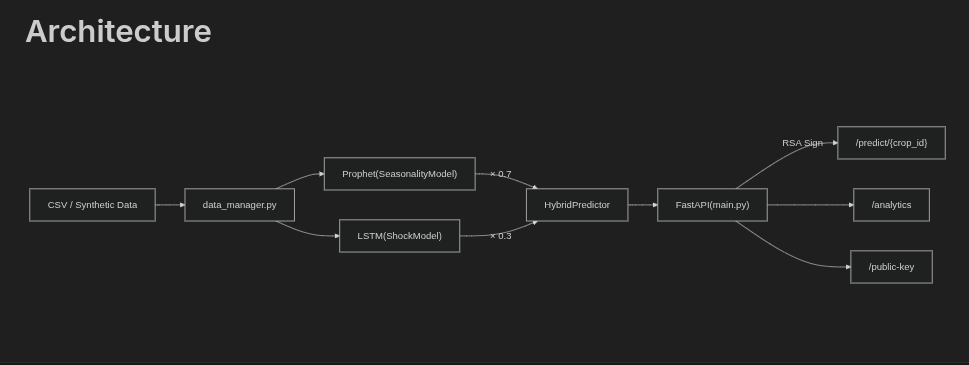

# AgroStack — AI Price Engine

## Architecture




## Components

- **data_manager.py**: Handles data preprocessing, scaling, and sequence generation.
- **engine.py**: The hybrid model fusing Prophet (trend) and LSTM (shocks).
- **main.py**: FastAPI application with RSA signing logic.

## How to Run

```bash
# Ensure you are using Python 3.11.8
python -m venv .venv
source .venv/bin/activate
pip install -r requirements.txt
uvicorn main:app --host 0.0.0.0 --port 8000 --reload
```

## API Endpoints

- `GET /predict/{crop_id}`: Returns a signed price prediction.
- `GET /analytics`: Model confidence and shock alerts.
- `GET /public-key`: RSA public key for verification.

> [!NOTE]
> Training occurs on startup and may take a moment.